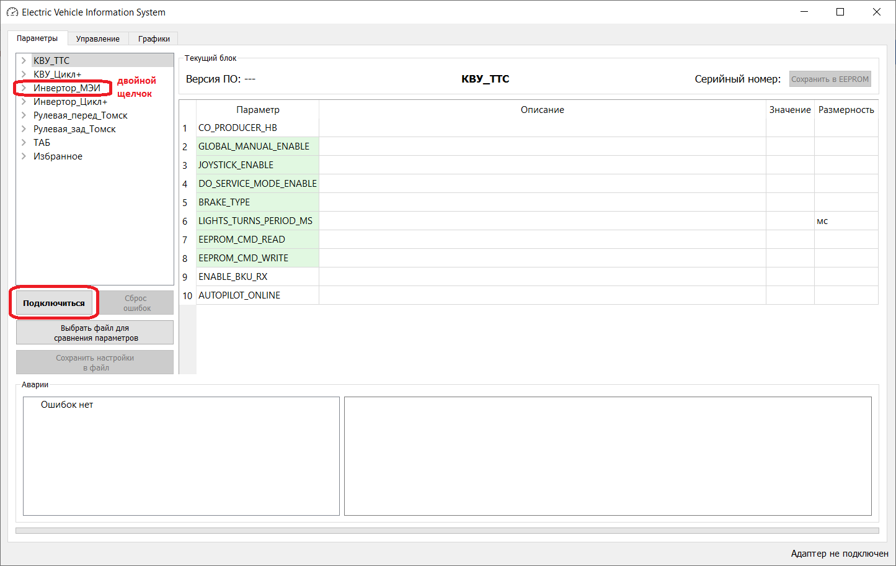
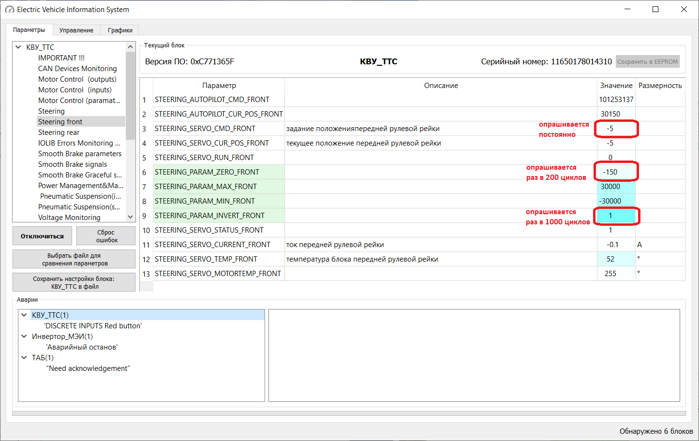
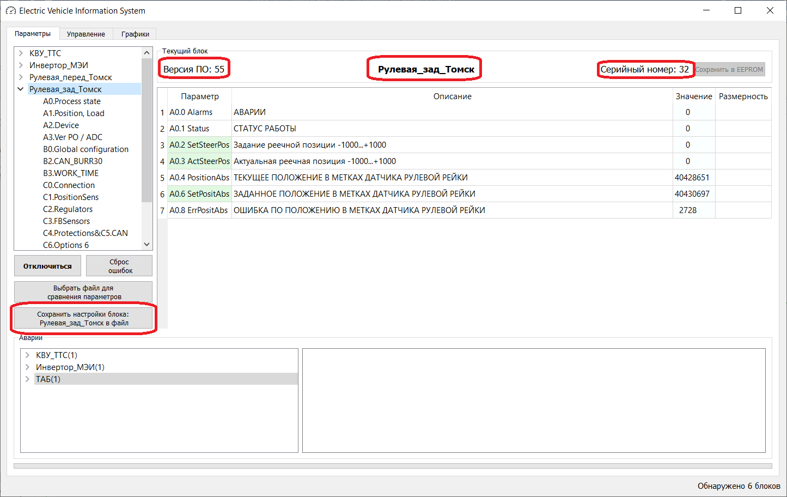
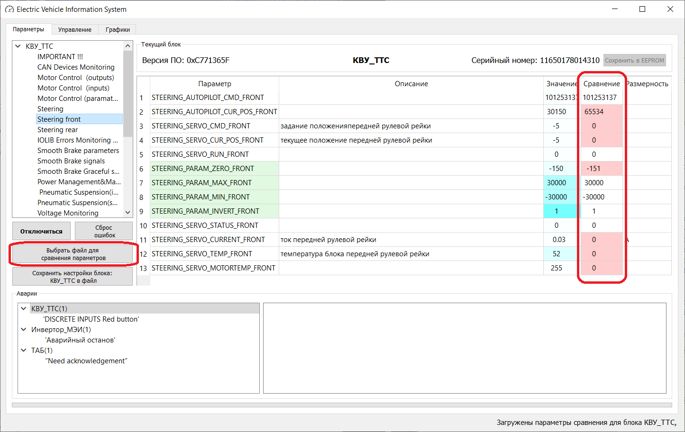
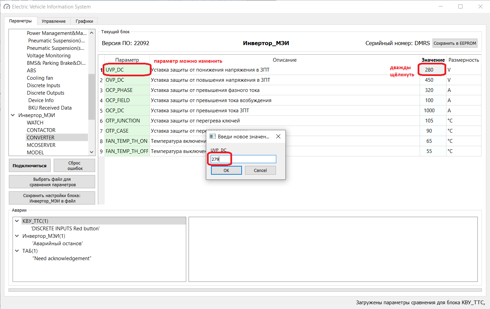
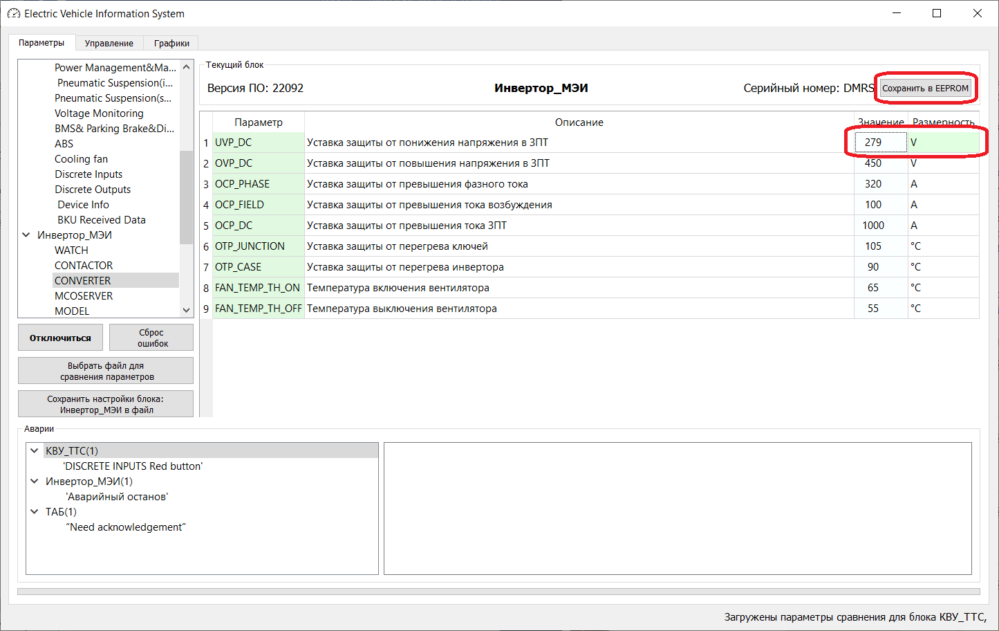
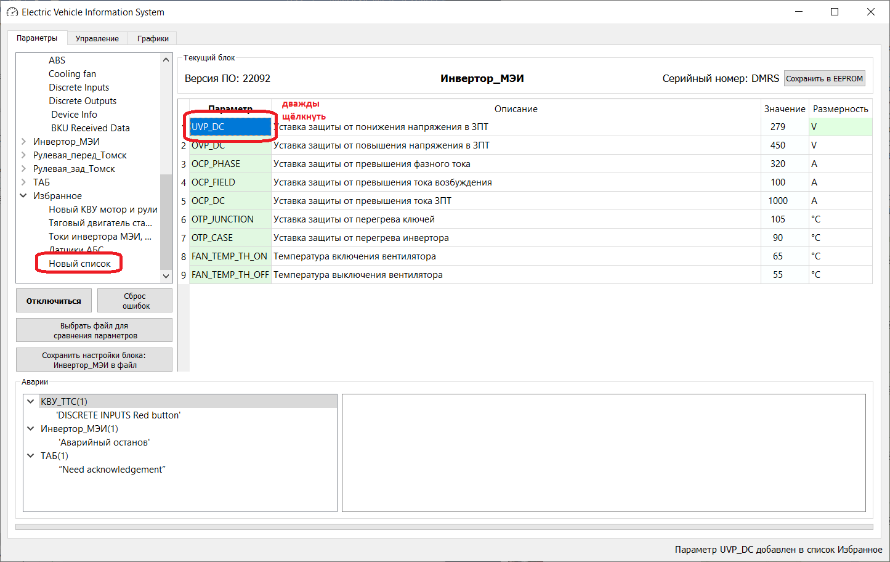
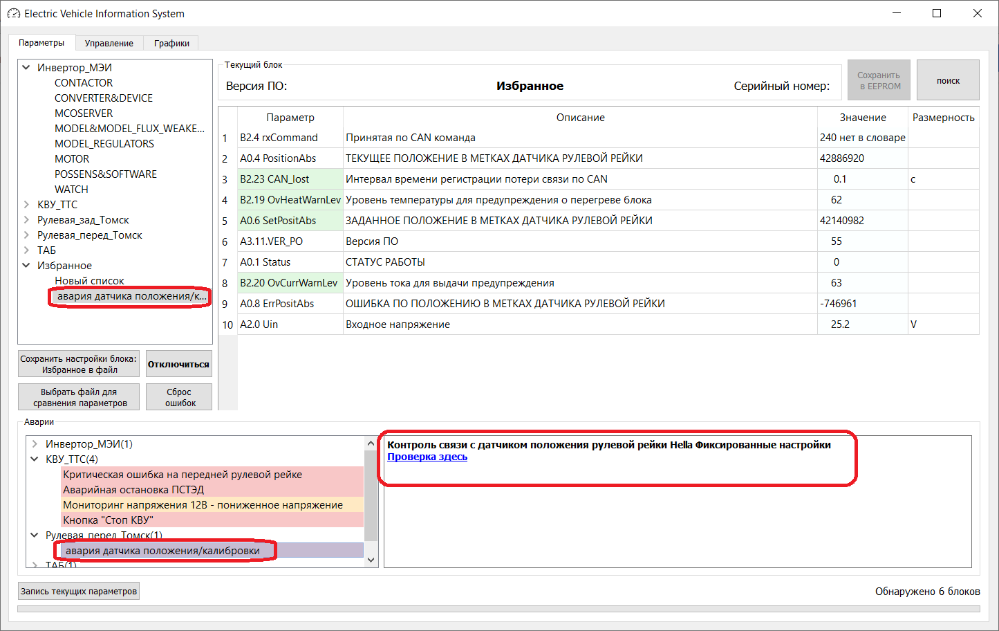
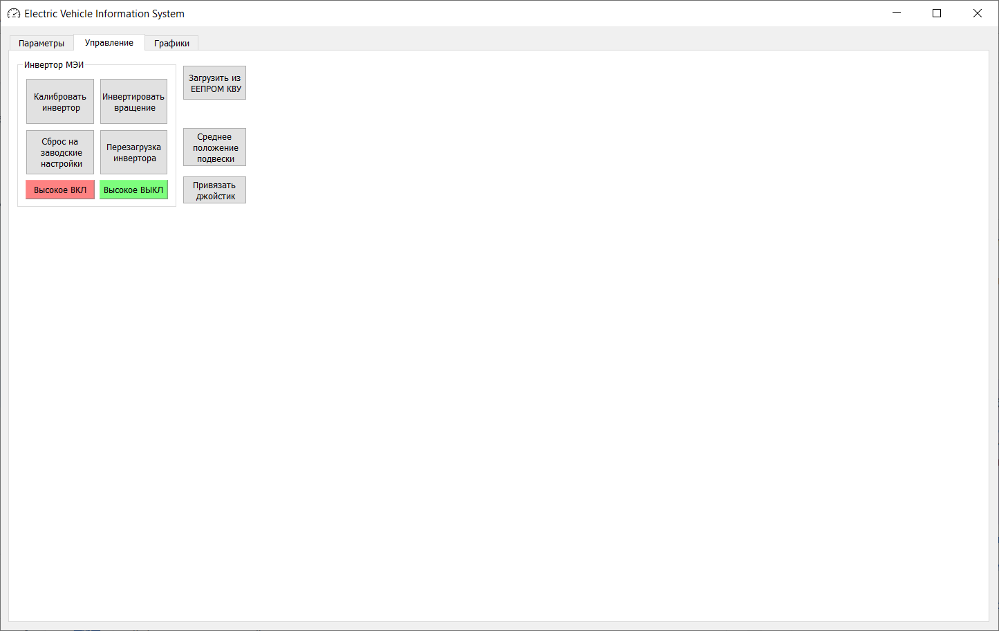
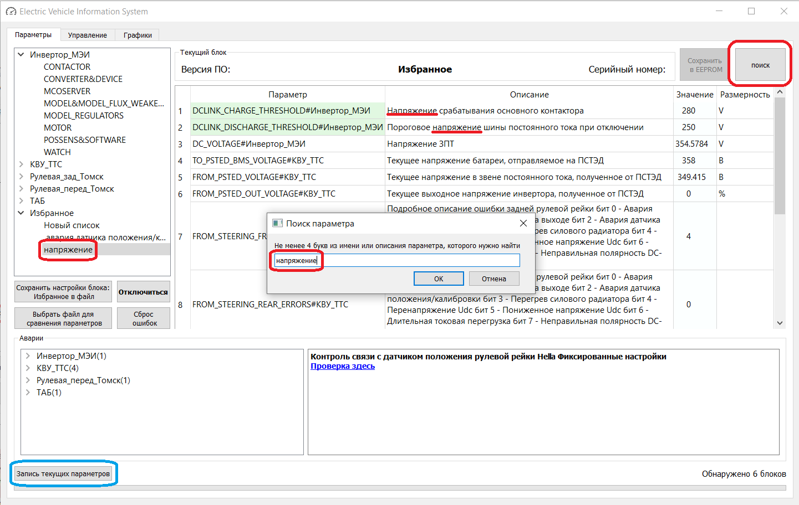

# VMU_monitor
## Запуск программы
Если всё пошло по плану, программа сразу же при запуске определит адаптер, какие шины подключены и какие блоки выходят на связь, подключится к первому блоку и считает ошибки. 

Если при запуске программа выдаёт системную ошибку , нужно обязательно сделать скриншот ошибки и отправить в телеграмм Тимофей Иноземцев
Если программа запускается, но выдаёт ошибку Адаптер не обнаружен, возможные причины:
* нет надёжного соединения ноутбук-адаптер (проверить, чтоб горел зелёный индикатор на адаптере МАРАФОН, в противном случае заменить провод)
* нет надёжного соединения адаптер-ВАТС(можно попробовать другой удлинитель ВАТС-адаптер)
* выключено питание ВАТС(на панели управления должен гореть зелёный индикатор)
* отсутствуют сигналы в шине CAN1. Без определения CAN1 программа работать не будет

При этом будет выведен полный список всех возможных блоков, параметры и ошибки считываться не будут до правильного подключения к ВАТС. Когда подключение создано, следует нажать кнопку Подключиться, либо двойной щелчок по нужному блоку 

При удачном запуске и правильном подключении программа выведет в левой верхней части список найденных блоков. В правой части будут считаны параметры первого блока, внизу считываются ошибки всех определённых блоков, если имеются. Список блоков можно раскрыть и считать параметры по группам. Чем синее поле Значение параметра, тем реже опрашивается его текущее значение. Параметры с белым полем опрашиваются постоянно, с синим - раз в 1000 циклов. 

## Сохранение параметров блока в файл
В верхней части, над списком текущих параметров отображено имя текущего блока, его серийный номер и версия ПО. Чтоб сохранить в файл ВСЕ параметры с текущего блока, нужно нажать  кнопку Сохранить настройки в файл. Сохранение параметров в формате Excel с именем блока, его серийным номером и временем сохранения в папку /ECU_Settings/ в папке с программой

## Сравнение параметров из файла с текущими
Можно сравнить настройки блоков подключенного ВАТС с настройками ранее сохранённых блоков. Нужно нажать кнопку Загрузить файл для сравнения. Затем выбрать Excel файл сохранённых ранее настроек. Обычно файлы с настройками хранятся в папке /ECU_Settings/ в папке с программой. Можно выбрать файлы нескольких блоков. После этого параметры сравнения будут отображены в столбце правее текущих параметров. Файл параметров рулевой рейки сравнивается сразу с обоими блоками, которые есть на подключенном ВАТС. Если значения параметров разняться, они будут подкрашены красным. Автоматическое сохранение параметров из файла в блок не предусмотрено, нужно пройтись по всем вкладкам и сравнить визуально параметры из файла и из блока и менять их только при полном понимании что ты делаешь.

## Изменение значения параметра
Имя параметра, значение которого можно изменить, подкрашено зелёным цветом. Параметры с белыми именами изменить нельзя, они только для наблюдения. 
Чтоб изменить нужный, доступный для изменения, параметр нужно дважды щёлкнуть по его ЗНАЧЕНИЮ - там, где цифры. Появится диалоговое окно, где можно ввести новое значение. После этого подтвердить изменение кнопкой Ок или нажатием Enter. 

 Если блок принял изменённый параметр, поле рядом с ним окрасится в зелёный цвет, если изменение не прошло, поле окрасится в красный и программа выдаст то значение, что считалось из блока.

В некоторых блоках после изменения параметра его значение сохраняется только до выключения зажигания, при перезагрузке блока, параметры будут загружены из ЕЕПРОМ блока. Чтобы сохранить изменённый параметр в ЕЕПРОМ блока, нужно после изменения нажать кнопку вверху справа Сохранить в ЕЕПРОМ. Сохранение произойдёт только в текущий блок. При сохранении параметров в блок Инвертор МЭИ необходимо выключить высокое напряжение и после сохранения в ЕЕПРОМ блок автоматически перезагрузится - это особенность работы блока

## Пользовательский список параметров
Изначально все блоки представлены с параметрами, разделённым по группам, согласно производителю. Часто бывает, что не все параметры из группы нужны для текущего наблюдения. Или нужно просматривать параметры сразу из нескольких блоков. Для удобства просмотра можно создать свой, удобный для наблюдения список параметров. Для этого надо открыть вкладку нужного блока на нужной группе параметров и дважды щёлкнуть на ИМЕНИ нужного  параметра, после этого во вкладке Избранное появится группа Новый список и параметр добавится в этот список. В один список можно выбрать параметры из разных блоков. Желательно не набирать больше 10-15 параметров, иначе их опрос будет медленнее. Чтоб удалить ненужный параметр из Нового списка, нужно дважды щёлкнуть по названию параметра. Новый список будет существовать до перезагрузки программы, если этот список нужно сохранить для дальнейшего использования, нужно изменить его имя. Для этого надо дважды щёлкнуть на названии Новый список и изменить его в диалоговом окне. После этого удалять из него параметры уже не получится и при перезапуске программы этот список уже будет во вкладке Избранное. 

## Ошибки блоков
Внизу слева выводятся ошибки, считанные со всех обнаруженных блоков. Критические ошибки подкрашены красным, предупреждения - оранжевым. Так как новый КВУ ТТС выдаёт свои ошибки по одной, есть смысл подождать секунд 10-15 пока сформируется полный список его ошибок. Если щёлкнуть по ошибке, в правом окне появится описание этой ошибки(если есть) и ссылки на Confluence где описывается что с этой ошибкой делать(если есть уже описание ремонта(спойлер-почти нет)). Также, если для этой ошибки определён список параметров, которые нужно проверить, то в Избранном появится новый список с этими параметрами.
Сбросить ошибки всех блоков можно кнопкой Сброс ошибок. Возможно, нужно нажать несколько раз, новый КВУ туповат.

## Дополнительные функции
На вкладке Управление есть пока несколько кнопок для некоторых часто используемых функций. В основном, это повторение функций из программы SRM-Drive-Monitor(Linux) для Инвертора МЭИ. Для любых манипуляций с Инвертором МЭИ требуется выключить высокое напряжение. Кнопка Загрузить из ЕЕПРОМ КВУ нужна для восстановления текущих значений параметров на те, что находятся ЕЕПРОМ КВУ (кто бы мог подумать). Тоже самое происходит при перезагрузке КВУ. Если предварительно значения уже были сохранены в ЕЕПРОМ КВУ, чуда не произойдёт. 

## Поиск параметра
Так как блоков несколько сложно сразу найти нужный параметр, поэтому есть возможность поиска параметра по его названию или описанию. Для этого нажми кнопку Поиск. Для более точного поиска нужно ввести хотя бы 4 символа нужного параметра. После этого будет выведен новый список со всеми найденными параметрами, в названии, или описании которых есть искомые символы.
## Запись логов
Чтоб сохранить лог текущего списка параметров нажми кнопку Запись текущих параметров. После этого блокируются все остальные действия и запускается запись лога текущего списка со скоростью 10мс/параметр, т.е. чем меньше параметров в списке, тем быстрее будет происходить обновление всего списка. Чтоб остановить запись нажми ту же кнопку. Лог сохраняется в виде Excel файла с названием текущего списка параметров в папке /ECU_Records/

 
